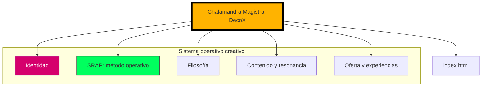

# Chalamandra Magistral DecoX

**Decodificar lo complejo. Diseñar lo accionable.**

Chalamandra Magistral DecoX es un sistema creativo-filosófico de soberanía técnica y creativa. Desarrolla metodologías, sistemas de análisis y herramientas prácticas para convertir problemas complejos en estructuras comprensibles y procesos accionables.

La empresa combina pensamiento estratégico, diseño de sistemas y herramientas de conocimiento para transformar ideas dispersas en estructuras que puedan analizarse, desarrollarse y ponerse en práctica.

## Arquitectura de la marca

La marca se entiende como un sistema de seis niveles:

1. **Identidad:** Chola, Fresa y Malandra son funciones de un mismo sistema.
    - **Chola, hardware:** experiencia, resistencia, disciplina y realidad.
    - **Fresa, interfaz:** estética, refinamiento, lenguaje y percepción.
    - **Malandra, motor:** estrategia, adaptación, anticipación y lectura del juego.
2. **Filosofía:** soberanía técnica y creativa.
3. **Método:** SRAP, Sincronización Ritmo-Acción Presente.
4. **Contenido:** crónicas, relatos, reels e imágenes que generan resonancia.
5. **Oferta:** talleres, consultoría, diseño de sistemas y arquitectura de marca.
6. **Experiencia:** formatos interactivos como Genially y Los 6 Sombreros.

La lógica central es:

**Experiencia → Decodificación → Estrategia → Diseño → Acción**

El siguiente diagrama resume esta arquitectura:

## DecoX

**DecoX = Decodificar + X.**

X representa la variable, el problema, el sistema o el contexto que queremos comprender. DecoX parte del análisis para identificar componentes, relaciones, fricciones y posibilidades de intervención.

El recorrido de trabajo es:

**Experiencia → Decodificación → Estrategia → Diseño → Acción.**

## SRAP

SRAP significa **Sincronización Ritmo-Acción Presente**. Es el mecanismo operativo de Chalamandra Magistral DecoX:

**Idea → decisión → acción → observación → ajuste.**

Su objetivo es reducir la distancia innecesaria entre comprender algo y actuar sobre ello. **Latencia 0** es una meta metodológica, no una promesa literal de tiempo cero.

## Ecosistema

* **Página principal** (`index.html`): presentación de Chalamandra Magistral DecoX y su sistema de trabajo.
* **Arquetipo:** [documentos/archetype.md](documentos/archetype.md), documento rector de identidad, filosofía, método y oferta.
* **Metodologías:** SRAP y futuros sistemas propios.
* **Herramientas:** plantillas, kits y productos de conocimiento.
* **Productos y experiencias:** talleres, consultoría, arquitectura de marca, diseño de sistemas y experiencias interactivas de pensamiento estratégico.
* **Estrategia comercial:** [documentos/estrategia-comercial.md](documentos/estrategia-comercial.md), mapa de dinero, ofertas iniciales, GBP, experimento de 30 días y control de rentabilidad.
* **Manifiesto:** documento fundador disponible en [chalamandramagistral.com](https://chalamandramagistral.com).

## Alcance técnico

Este repositorio contiene un sitio estático HTML, CSS y JavaScript. La página principal incorpora una visualización interactiva desarrollada con Three.js. No utiliza Node.js ni dependencias npm locales.

---

*© 2026 Chalamandra Magistral DecoX.*
i94